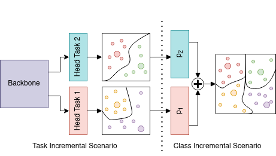

# Centroids Matching: an efficient Continual Learning approach operating in the embedding space

### [Jary Pomponi](https://scholar.google.com/citations?user=Zha7UeoAAAAJ&hl=en&authuser=1), [Simone Scardapane](https://www.sscardapane.it/), and [Aurelio Uncini](http://www.uncini.com/)

[[ArXiv preprint]()]

## Abstract :bookmark_tabs:

Catastrophic forgetting (CF) occurs when a neural network loses the information previously learned while training on a set of samples from a different distribution, i.e., a new task. Existing approaches have achieved remarkable results in mitigating CF, especially in a scenario called task incremental learning. However, this scenario is not realistic, and limited work has been done to achieve good results on more realistic scenarios. In this paper, we propose a novel regularization method called Centroids Matching, that, inspired by meta-learning approaches, fights CF by operating in the feature space produced by the neural network, achieving good results while requiring a small memory footprint. Specifically, the approach classifies the samples directly using the feature vectors produced by the neural network, by matching those vectors with the centroids representing the classes from the current task, or all the tasks up to that point. Centroids Matching is faster than competing baselines, and it can be exploited to efficiently mitigate CF, by preserving the distances between the embedding space produced by the model when past tasks were over, and the one currently produced, leading to a method that achieves high accuracy on all the tasks, without using an external memory when operating on easy scenarios, or using a small one for more realistic ones.
% The novelty of our proposal is that it works in the embedding space of the tasks, both during the training and during the mitigation of the CF. 
Extensive experiments demonstrate that CM achieves accuracy gains on multiple datasets and scenarios.

## Centroids Matching (CM) in short :dart:

CM is an approach to alleviate the catastrophic forgetting while training a neural network on a new set of samples, which is based on a neural networks that operates directly in the embedding space, by creating a centroid for each class, and forcing the samples to be as close as possible to the correct centroid. 
It is capable of alleviating the CF in two possible scenarios: Task and Class Incremental Learning. 
In the first one, the model is simply regularize by reducing the distance between the output obtained while training the current task and the ones obtained from the past model.   
In the latter scenario, we also use an external memory containing samples from past tasks, and the embeddings spaces of past tasks are merged while training on the new one.

A visual overview of how the approach works is the following:

<p align="center">

<p >

## How to use the code and replicate the results 

The entry point used to run the code is the script ```main.py```, which CMD input is a hydra configuration; please check the hydra library to understand how it works. 

For reference, folder ```configs``` contains all config files used, and the folder ```bash``` contains all the scripts used to run the experiments. 

## Requirements

The required libraries are:

* PyTorch 1.12
* Torchvision 0.13
* [Avalanche 0.1.0](https://github.com/ContinualAI/avalanche)
* [Hydra 1.1.1](https://github.com/facebookresearch/hydra)

## Cite

Please cite our work if you found it useful:

```

```
